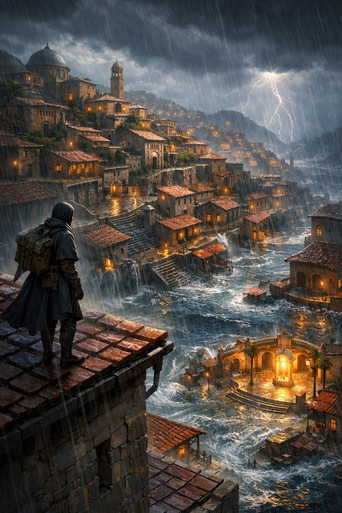
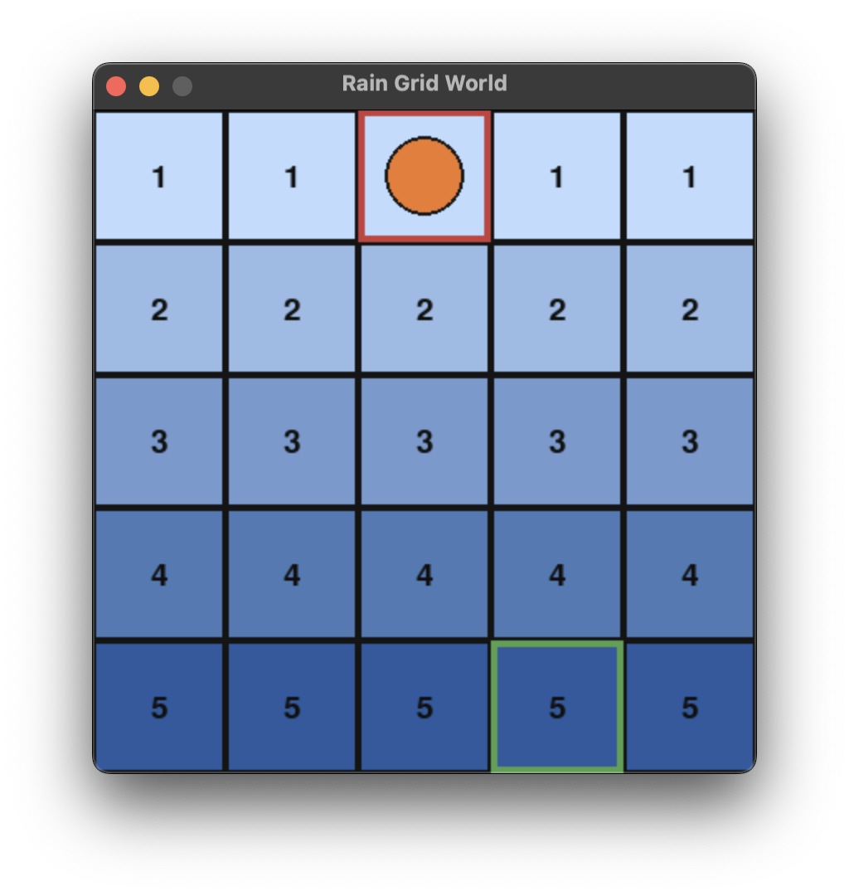

# Rain Grid World

Design and developed by: **Mobin Nesari**, **Farhang Taher Ardakani**, **Hanieh Ghorbanpour**

## Lore

The city of Aqualon sits on a steep, tiled hillside. A sudden storm hits, and rainwater begins to pool in the lower streets. The higher squares stay mostly dry, while the lower ones flood quickly and become costly to traverse. Your agent is a courier starting at the top-left rooftop, trying to reach the evacuation point at the bottom-right plaza before the streets become too dangerous.

Every step downward is heavier than the one before it. The deeper you go, the more the rain accumulates. This is why the grid is calm at the top and harsh at the bottom: the cost increases monotonically as you move down.
<p align="center"></p>

## Environment Summary

- Grid size: 5x5
- Start: top-left cell `(row=0, col=0)` by default, or a random top-row cell when `random_start=True`
- Goal: bottom-right cell `(row=4, col=4)` by default, or a random last-row cell when `random_goal=True`
- Cost: increases per row, higher rows are cheaper than lower rows
- Rain accumulation: modeled as a monotonic row cost (lower rows are more expensive)

<p align="center"></p>

## Formal Details

- **Observation space:** `Box(low=0, high=4, shape=(2,), dtype=int64)`
  - Observation is the agent position `[row, col]`.
- **Action space:** `Discrete(4)`
  - `0=up`, `1=right`, `2=down`, `3=left`
- **Reward:** `-cell_cost` of the new position
  - Higher cost in lower rows means more negative reward.
- **Termination:** episode ends when the agent reaches the current goal cell
- **Truncation:** optional, if `max_steps` is set
- **Optional args:**
  - `random_start=False`: if `True`, start each episode from a random cell on the top row
  - `random_goal=False`: if `True`, place the goal each episode on a random cell in the last row

## How to Use

Basic usage:

```python
from world_env import RainGridEnv

env = RainGridEnv(grid_size=5, max_steps=200, render_mode="human")
obs, info = env.reset()

done = False
while not done:
    action = env.action_space.sample()
    obs, reward, terminated, truncated, info = env.step(action)
    env.render()
    done = terminated or truncated

env.close()
```

Randomized start/goal:

```python
env = RainGridEnv(
    grid_size=5,
    max_steps=200,
    render_mode="human",
    random_start=True,
    random_goal=True,
)
```

## Visualization Notes

- The background uses a light-to-dark blue gradient from top to bottom.
- Each cell displays its cost value.
- The goal is outlined in green (at its current location), and the agent is an orange circle.

## Why This Design

The monotonic row cost mirrors real rain accumulation: gravity moves water downhill, so lower areas flood first and most severely. This makes the agent balance distance-to-goal against the growing traversal cost as it moves downward.
